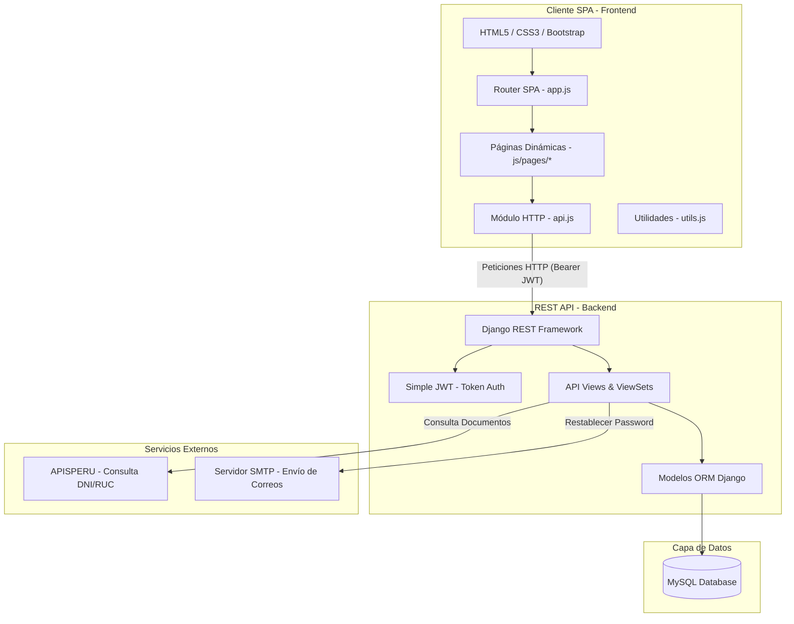

# 🏪 Sistema de Gestión y Punto de Venta (POS) para Minimarkets

Sistema de punto de venta (POS) y control de inventario de última generación con **Backend API REST** (Django 5 + DRF) y **Frontend SPA** (HTML5 + Vanilla JS + CSS3). Cuenta con control avanzado de lotes por fecha de vencimiento (**FEFO**), gestión de caja diaria y facturación electrónica integrada (consulta de DNI/RUC vía APISPERU).

---

## 📋 Tabla de Contenidos
1. [📐 Arquitectura del Sistema](#-arquitectura-del-sistema)
2. [✨ Características Principales](#-características-principales)
3. [💻 Requisitos del Sistema](#-requisitos-del-sistema)
4. [📂 Estructura del Proyecto](#-estructura-del-proyecto)
5. [🗄️ Esquema de la Base de Datos](#%EF%B8%8F-esquema-de-la-base-de-datos)
6. [⚙️ Configuración del Entorno (.env)](#%EF%B8%8F-configuracion-del-entorno-env)
7. [🚀 Guía de Instalación y Ejecución](#-guia-de-instalacion-y-ejecucion)
8. [📡 Endpoints de la API REST](#-endpoints-de-la-api-rest)
9. [🛠️ Optimización para Producción](#%EF%B8%8F-optimizacion-y-consejos-para-produccion)
10. [📄 Licencia](#-licencia)

---

## 📐 Arquitectura del Sistema

El sistema implementa una arquitectura desacoplada donde el cliente SPA (Single Page Application) realiza peticiones asíncronas seguras a la API REST utilizando un token portador (Bearer JWT).



---

## ✨ Características Principales

### 🔒 Seguridad y Acceso
*   **Autenticación JWT:** Seguridad de sesión basada en tokens con ciclo de refresco automático (Access de 2 horas / Refresh de 24 horas).
*   **Roles y Permisos:** Acceso diferenciado entre `ADMIN` (acceso a compras, reportes y configuración general) y `VENDEDOR` (POS y caja diaria).
*   **Recuperación de Clave:** Restablecimiento seguro de contraseña mediante enlaces temporales enviados por correo (SMTP).

### 📦 Inventario y FEFO (First Expired, First Out)
*   **Multisucursal (Mercados):** Aislamiento de datos y control de stock independiente para múltiples sedes físicas.
*   **Trazabilidad de Lotes:** Seguimiento unitario o decimal por lotes con fechas de vencimiento.
*   **Descuento Automático FEFO:** Descuento inteligente en ventas que selecciona automáticamente las unidades más cercanas a expirar.
*   **Historial Kardex:** Registro detallado de movimientos de entrada, salida, ajustes y transferencias entre locales.
*   **Valoración del Stock:** Valoración automática del inventario actual en base al costo medio/adquisición de productos.

### 🛒 Terminal de Ventas (POS) y Caja
*   **Carrito de Compras POS:** Interfaz ágil que permite la lectura directa de código de barras o búsqueda interactiva por nombre.
*   **Integración APISPERU:** Autocompletado del nombre o razón social al buscar por DNI o RUC desde SUNAT.
*   **Arqueo de Cajas:** Conciliación de caja detallando ingresos en Efectivo, Yape y Plin frente al conteo físico del cajero al cierre.

---

## 💻 Requisitos del Sistema

Para ejecutar el proyecto de forma local, asegúrate de contar con:
- **Python:** Versión `3.8` o superior.
- **Base de Datos:** **PostgreSQL** (Hospedado en **Supabase** o local).
- **Navegador:** Cualquier navegador moderno compatible con JS ES6.

---

## 📂 Estructura del Proyecto

```
proyecto-minimarket-FINAL/
├── backend/                            # Servidor API REST (Django)
│   ├── pos_minimarket/                 # Configuración principal
│   │   ├── settings.py                 # Configuración y dependencias
│   │   └── api_urls.py                 # Enrutador principal de endpoints API
│   ├── usuarios/                       # Gestión de cuentas y roles
│   ├── inventario/                     # Productos, lotes (FEFO) y Kardex
│   ├── ventas/                         # Lógica del POS, clientes y cajas
│   ├── compras/                        # Órdenes de compra a proveedores
│   ├── proveedores/                    # Directorio de proveedores
│   ├── reportes/                       # Consultas y exportador Excel/PDF
│   ├── manage.py                       # Administrador de comandos de Django
│   ├── requirements.txt                # Dependencias del backend (psycopg2-binary)
│   └── .env                            # Variables de configuración local
├── frontend/                           # Aplicación de Cliente (SPA)
│   ├── index.html                      # Archivo de entrada HTML
│   ├── css/                            # Hojas de estilo modulares
│   │   ├── main.css                    # Estilo principal de carga
│   │   ├── variables.css               # Definición de paletas (Modo Claro/Oscuro)
│   │   └── ...                         # Componentes, tablas, formularios, etc.
│   └── js/                             # Controladores y lógica en JavaScript
│       ├── app.js                      # Router del SPA e inicializador
│       ├── api.js                      # Cliente HTTP (Fetch wrapper + JWT)
│       ├── auth.js                     # Gestión de almacenamiento de tokens
│       ├── utils.js                    # Formateadores, Toasts y Modales
│       └── pages/                      # Lógica de cada vista o página del sistema
└── media/                              # Almacenamiento de imágenes de productos
```

---

## 🗄️ Esquema de la Base de Datos

| Modelo | Módulo / App | Propósito principal | Relaciones |
| :--- | :--- | :--- | :--- |
| **`Mercado`** | `inventario` | Representa cada sucursal física del minimarket. | - |
| **`Usuario`** | `usuarios` | Cuentas del sistema con rol de administrador o vendedor. | `mercado` (FK) |
| **`Categoria`** | `inventario` | Categorización de productos aislados por sucursal. | `mercado` (FK) |
| **`Producto`** | `inventario` | Catálogo de productos con precios, costos y stock actual. | `categoria`, `mercado` (FK) |
| **`UnidadProducto`** | `inventario` | Registro de lotes y fechas de vencimiento de cada unidad. | `producto`, `mercado` (FK) |
| **`Kardex`** | `inventario` | Registro contable e inmutable de movimientos de stock. | `producto`, `mercado` (FK) |
| **`Transferencia`** | `inventario` | Control de envíos y tránsito de stock entre sucursales. | `mercado_origen/destino` (FK) |
| **`Caja`** | `ventas` | Sesiones de caja diaria con balances de apertura y arqueo. | `usuario`, `mercado` (FK) |
| **`Cliente`** | `ventas` | Directorio de clientes con DNI o RUC. | - |
| **`Venta`** | `ventas` | Registro principal de transacciones de venta. | `cliente`, `mercado`, `caja` (FK) |
| **`Compra`** | `compras` | Registro de compras y abastecimiento de inventario. | `proveedor`, `usuario` (FK) |

---

## ⚙️ Configuración del Entorno (`.env`)

Crea un archivo llamado `.env` dentro de la carpeta `/backend` y define las siguientes variables:

```env
# Core Django
SECRET_KEY=django-insecure-pos-minimarket-key
DEBUG=True
ALLOWED_HOSTS=*

# Base de datos (PostgreSQL - Supabase)
DB_ENGINE=postgresql
DB_NAME=postgres
DB_USER=postgres
DB_PASSWORD=tu_contraseña_supabase
DB_HOST=db.qbxyktylozbtdbuwvfid.supabase.co
DB_PORT=5432
DB_USE_SSL=True


# Integraciones Externas
APISPERU_TOKEN=tu_token_de_apisperu

# Configuración de Correo (SMTP)
SMTP_HOST=smtp.gmail.com
SMTP_PORT=587
SMTP_USER=tu_correo@gmail.com
SMTP_PASS=tu_contraseña_aplicacion_gmail
DEFAULT_FROM_EMAIL="Minimarket POS <tu_correo@gmail.com>"

# Frontend URL
FRONTEND_URL=http://127.0.0.1:5500
```

---

## 🚀 Guía de Instalación y Ejecución

### 1. Preparar el Servidor Backend
Accede a una terminal e ingresa a la raíz del proyecto.

```bash
# Crear el entorno virtual
python -m venv venv

# Activar el entorno virtual
# En Windows (PowerShell):
.\venv\Scripts\activate
# En Linux/macOS:
source venv/bin/activate

# Instalar dependencias requeridas
pip install -r backend/requirements.txt
```

### 2. Configurar Base de Datos y Migrar
Inicia tu servicio de MySQL y crea la base de datos:
```sql
CREATE DATABASE minimarket CHARACTER SET utf8mb4 COLLATE utf8mb4_unicode_ci;
```

Aplica las migraciones iniciales y crea el usuario administrador:
```bash
cd backend
python manage.py migrate
python manage.py createsuperuser
```

### 3. Ejecutar los Servidores

#### Levantar el Backend (API)
```bash
# Dentro de la carpeta /backend
python manage.py runserver
```
*La API estará escuchando en `http://127.0.0.1:8000/api/`*

#### Levantar el Frontend (SPA)
El frontend es estático y debe servirse localmente en el puerto `5500`.

*   **Usando la extensión "Live Server" de VS Code:**
    Abre el proyecto en VS Code, haz clic derecho sobre `frontend/index.html` y selecciona **"Open with Live Server"**.
*   **Usando Python en una nueva terminal:**
    ```bash
    cd frontend
    python -m http.server 5500
    ```

---

## 📡 Endpoints de la API REST

A continuación se listan las rutas clave de la API del sistema:

### 🔑 Autenticación y Cuentas
| Método | Endpoint | Descripción | Acceso |
| :--- | :--- | :--- | :--- |
| `POST` | `/api/auth/login/` | Obtención de tokens de acceso y de refresco JWT | Público |
| `POST` | `/api/auth/refresh/` | Obtención de nuevo token de acceso | Autenticado |
| `GET` | `/api/auth/me/` | Información básica del usuario actual | Autenticado |

### 📦 Gestión de Catálogo y Stock
| Método | Endpoint | Descripción | Acceso |
| :--- | :--- | :--- | :--- |
| `GET` / `POST` | `/api/productos/` | Listar y crear productos del mercado actual | Autenticado |
| `PATCH` / `DELETE` | `/api/productos/{id}/`| Editar y eliminar productos | Autenticado |
| `POST` | `/api/productos/{id}/ajustar/` | Realizar ajuste manual de stock (Kardex) | Autenticado |
| `POST` | `/api/productos/importar/` | Importar productos masivamente desde Excel | Admin |
| `GET` | `/api/kardex/` | Historial de movimientos de stock con filtros | Autenticado |
| `GET` | `/api/vencimientos/` | Listar lotes próximos a vencer | Autenticado |

### 🛒 Ventas, Clientes y Cajas
| Método | Endpoint | Descripción | Acceso |
| :--- | :--- | :--- | :--- |
| `GET` / `POST` | `/api/ventas/` | Listar ventas del mercado y registrar nueva venta | Autenticado |
| `POST` | `/api/ventas/{id}/anular/` | Anular venta y retornar stock al lote de origen | Autenticado |
| `GET` | `/api/clientes/consultar-documento/` | Buscar DNI o RUC en base local / API SUNAT | Autenticado |
| `POST` | `/api/cajas/apertura/` | Registrar saldo inicial de la caja | Autenticado |
| `POST` | `/api/cajas/{id}/cierre/` | Registrar arqueo y cerrar sesión de caja | Autenticado |

### 🚚 Logística y Reportes
| Método | Endpoint | Descripción | Acceso |
| :--- | :--- | :--- | :--- |
| `GET` / `POST` | `/api/transferencias/` | Listar e iniciar transferencia de lotes | Autenticado |
| `POST` | `/api/transferencias/{id}/recibir/` | Confirmar recepción de transferencia | Autenticado |
| `POST` | `/api/transferencias/{id}/rechazar/` | Cancelar transferencia y retornar stock | Autenticado |
| `GET` | `/api/reportes/ventas/excel/` | Exportar historial de ventas a Excel | Admin |
| `GET` | `/api/reportes/ventas/pdf/` | Generar informe financiero en PDF | Admin |

---

## 🛠️ Optimización y Consejos para Producción

1. **Variables CORS**: Restringe la lista `CORS_ALLOWED_ORIGINS` en `settings.py` a tus URLs de dominio de producción.
2. **Caché Distribuida**: Cambia la configuración `CACHES` para usar **Redis** (`django-redis`) en lugar de caché local en memoria.
3. **Compresión de Archivos**: Las imágenes de productos cargadas al servidor son procesadas automáticamente con `Pillow` y comprimidas a un tamaño óptimo para no degradar el ancho de banda del servidor.
4. **Archivos Estáticos**: Utiliza Nginx para servir la aplicación frontend estática y el directorio `/media`, dejando que Gunicorn procese únicamente las solicitudes dinámicas de Django.

---

## 📄 Licencia

Este proyecto se distribuye bajo la licencia **MIT**. Para más detalles, consulta el archivo `LICENSE`.
